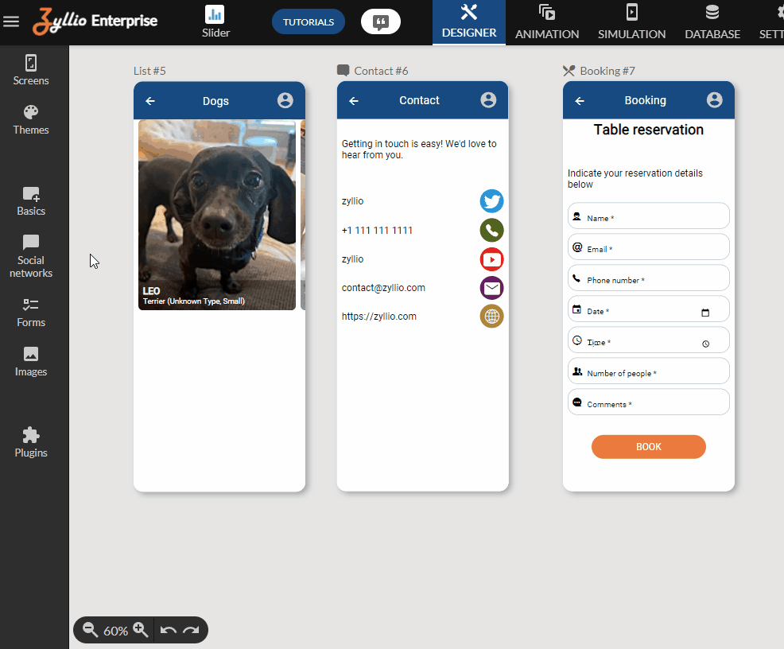

# Zyllio Plugin Theme

This Zyllio plugin implements a Theme

# Demonstration



# Development environment

Node.js 14+ is required

# Build

As this project is based on pure Javascript, it does not need compilation process

Run this command to get experiment using Zyllio SDK 

```shell
npm install
```

# Install

Only theme.js file is to be installed within Zyllio Studio under Designer/Plugins panel

# Fork this plugin

You are welcome to clone and fork this repository, looking forward your creativity 😀

# Support

Zyllio team is available for any support, feature requests and questions

- email: contact@zyllio.com
- twitter: [@zyllio](https://twitter.com/zyllio) 
